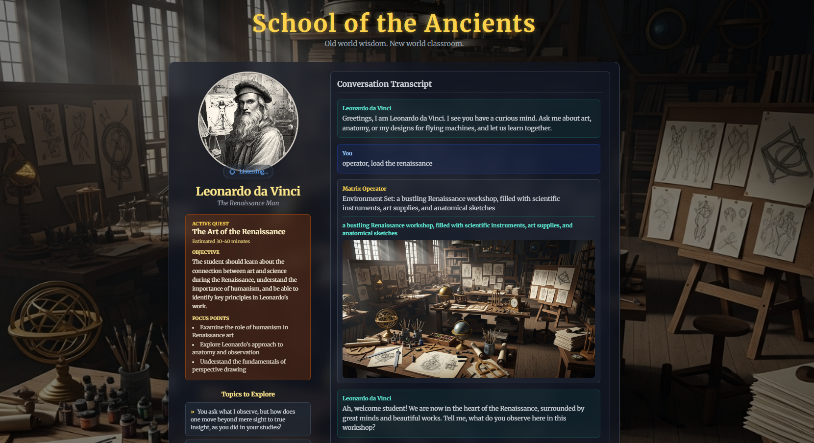

# School of the Ancients

**Engage in real-time, voice-driven conversations with AI-emulated historical figures and explore their worlds.**



---

## Table of Contents

- [Overview](#overview)
- [Feature Overview](#feature-overview)
  - [Conversational Core](#conversational-core)
  - [Immersive Worlds & Artifacts](#immersive-worlds--artifacts)
  - [Quest-Driven Learning](#quest-driven-learning)
  - [Custom Mentors & Quest Builder](#custom-mentors--quest-builder)
  - [Progression & Reflection](#progression--reflection)
- [Architecture Highlights](#architecture-highlights)
- [Getting Started](#getting-started)
  - [Prerequisites](#prerequisites)
  - [Installation](#installation)
  - [Running Locally](#running-locally)
  - [Building for Production](#building-for-production)
- [Using Learning Quests](#using-learning-quests)
  - [Joining Curated Quests](#joining-curated-quests)
  - [Creating Quests from Your Own Prompts](#creating-quests-from-your-own-prompts)
- [Development Tips](#development-tips)
- [Project Resources](#project-resources)
- [Troubleshooting](#troubleshooting)

---

## Overview

School of the Ancients is a modern web application that pairs immersive visuals with live audio conversations. Powered by the Google Gemini API, you can speak with legendary minds like Leonardo da Vinci, Socrates, and Cleopatra. Mentors converse in their authentic voice, adapt the scenery around you, and display custom artifacts to support the lesson. The result is a "Matrix Operator"-style learning environment that blends dialogue, imagery, and exploration.

## Feature Overview

### Conversational Core

- **AI-emulated mentors** &mdash; Each historical figure is defined by a richly crafted system prompt that captures personality, accent, and teaching style.
- **Dynamic voice conversations** &mdash; The Gemini Live API powers low-latency, two-way audio with real-time transcription and speech synthesis so you can speak naturally.
- **Socratic dialogue** &mdash; Mentors avoid blunt answers, instead guiding you with probing questions, comprehension checks, and follow-up challenges.

### Immersive Worlds & Artifacts

- **Environment control** &mdash; Ask the Operator to change the scenery (e.g., "Take me to the Roman Forum") and the background updates instantly.
- **Generated artifacts** &mdash; Request images or diagrams (e.g., "Show me a sketch of your flying machine", "Operator, show me leoarndo's flying machine") and the mentor will display bespoke visuals.
- **Ambient soundscapes** &mdash; Persona ambience tags pair each mentor with mood-setting audio for deeper immersion.

### Quest-Driven Learning

- **Curated quest board** &mdash; Pick from ready-to-run quests, each linking a legendary mentor with a focused learning objective and estimated duration.
- **Quest-aware conversations** &mdash; When a quest is active, the mentor keeps you on track, surfaces scene changes, and captures artifacts tied to the objective.
- **Automatic mastery reviews** &mdash; Ending a quest triggers an AI assessment of your transcript, summarizing what you grasped, what evidence proves it, and what to revisit.
- **Progress tracking** &mdash; Completed quest IDs persist in `localStorage`, powering progress meters and keeping your accomplishments pinned between sessions.

### Custom Mentors & Quest Builder

- **Character creator** &mdash; A guided flow assembles brand new mentors with Gemini-authored backstories, greetings, Socratic instructions, and Imagen-powered portraits.
- **Prompt-crafted quests** &mdash; Describe any learning goal ("Learn how to use github") and the Quest Architect designs a quest, selects the ideal mentor, and even forges a new persona if none exists.
- **Personalized parameters** &mdash; Tune quest difficulty, teaching style, or session length and the builder adapts the objective, focus points, and pacing.

### Progression & Reflection

- **Conversation history** &mdash; Sessions, transcripts, artifacts, and environments are stored in browser `localStorage` for later review or resuming quests.
- **Quest dossiers** &mdash; Each AI review summarizes mastery, highlights evidence, and recommends improvements so you can iterate on your learning plan.
- **Responsive design** &mdash; Tailwind CSS keeps the UI beautiful and accessible on mobile, tablet, and desktop displays.

## Architecture Highlights

- **Frontend stack**: React 19, TypeScript, Tailwind CSS, and Vite for development and bundling.
- **Gemini integrations**:
  - `gemini-2.5-flash-native-audio-preview-09-2025` drives live, bi-directional voice chat and function calling.
  - `imagen-4.0-generate-001` renders portraits, environments, and historical artifacts.
  - `gemini-2.5-flash` supports structured JSON output for the Character Creator and dynamic prompt generation.
- **Function calling workflow**: The frontend exposes `changeEnvironment` and `displayArtifact`. When the mentor or student decides to alter the scene, Gemini issues a structured call that triggers new imagery and UI updates instead of plain text.
- **Prompt engineering**: Persona prompts enforce the Socratic method, proactive tool use, and regular comprehension checks so every conversation feels guided and intentional.

## Using Learning Quests

### Joining Curated Quests

1. Open **Learning Quests** .
2. Browse the curated quest list to see recommended mentors, objectives, and estimated commitment.
3. Select a quest to automatically load the paired mentor, ambient environment, and contextual artifacts.
4. Engage in conversation. When you end the session, the AI mentor will evaluate your mastery, mark the quest complete if you passed, and save the transcript to history.

### Creating Quests

1. Choose **Create Your Quest** in the quest view to launch the Quest Architect.
2. Describe what you want to learn ("Master Renaissance perspective drawing" or "Understand quantum field theory from the world's greatest physicist").
3. Optionally set difficulty, teaching style, or time preferences. Leave fields as `auto` to let the AI decide.
4. The builder will generate a full quest brief, pick the most qualified mentor (or synthesize a new one with portrait, voice, and ambience), and queue the conversation.
5. Start the quest immediately; progress and mastery assessments are tracked the same way as curated quests.

## Getting Started

### Prerequisites

- **Node.js** 20 or later
- **npm** 10 or later (ships with modern Node releases)
- A Google Gemini API key with access to the realtime and Imagen models

### Installation

1. Clone the repository.
2. Install dependencies:
   ```bash
   npm install
   ```
3. Start the app and enter your Gemini API key from the in-app "Enter API key" button. Keys are stored locally in the browser and never committed.

### Running Locally

Start the Vite development server:

```bash
npm run dev
```

Visit the printed URL (defaults to http://localhost:3000) and grant the browser microphone access when prompted.

### Building for Production

Create an optimized build and preview it locally:

```bash
npm run build
npm run preview
```

Deploy the contents of `dist/` to your static hosting platform of choice.

## Development Tips

- Each visitor supplies their own Gemini API key via the in-app modal. The key is stored in `localStorage` on that device only.
- Shared UI components live in `components/`, while feature views are registered in `App.tsx`.
- Hooks such as `useGeminiLive` encapsulate audio capture, streaming, and playback logic.
- Tailwind utility classes handle layout; extend the Tailwind config before introducing custom CSS.
- No automated tests exist yet. If you add Vitest or other tooling, expose it through an `npm run test` script.

## Project Resources

- [`implementation.md`](implementation.md) &mdash; Deep-dive notes about system design choices and future ideas.
- [`docs/`](docs/) &mdash; Additional reference material and design explorations.
- [`audio/`](audio/) &mdash; Placeholder directory for local experimentation (do not commit generated artifacts).

## Troubleshooting

- **Missing Gemini key**: Use the "Enter API key" button in the header to paste a valid key from Google AI Studio. The key saves locally for future visits.
- **Microphone permissions**: Clear browser permissions if you accidentally deny access; audio capture is required for real-time chat.
- **Slow or missing visuals**: Imagen requests can take a few seconds. Watch the developer console for network errors if images do not appear.

---

Ready to explore? Launch the Operator, pick a mentor, and start your journey through history.
